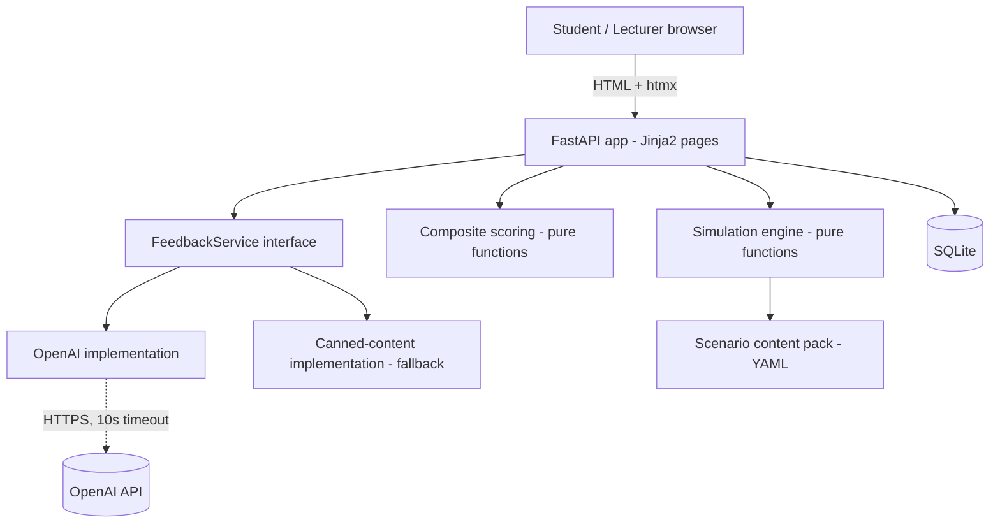
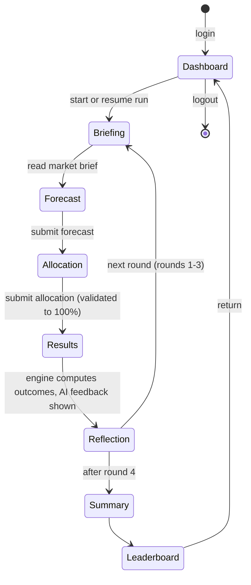

# Market Analyst Simulation MVP - Plan

## Goal Capsule

- **Objective:** Build a throwaway showcase MVP — a dockerised Python web app with one playable MBA simulation ("Market Analyst": market analysis & forecasting, investing a client's money across a synthetic share market over 4 rounds) — good enough to demo AI immersive learning value to the Regent Business School management team.
- **Authority:** This plan; where silent, the pilot constraints in the source PDFs (rule-based explainable outcomes, formative-first, AI for content not scores); where still silent, implementer judgment biased toward demo speed over engineering polish.
- **Execution profile:** Demo-quality code. Unit-test the deterministic engine and scoring (they must be explainable and correct); smoke-test everything else. No production hardening.
- **Stop conditions:** Stop and surface rather than guess if (a) the scenario content pack needs domain decisions beyond the authored defaults in U2, (b) the OpenAI integration cannot be exercised for lack of a key at test time (build against the fallback path and note it), or (c) scope pressure suggests adding LMS/auth/multi-module features — those are explicitly out.
- **Tail ownership:** Implementer runs the demo walkthrough checklist (Verification Contract) end-to-end before declaring done.

---

## Product Contract

### Summary

A single-container FastAPI web app where an MBA student plays a junior investment analyst managing R1,000,000 of a client's money across a fictional 6-share market over 4 quarterly rounds: read the market brief, record a forecast, allocate the portfolio, see rule-based explainable results, receive live AI coaching feedback, reflect, repeat. Individual play with a class leaderboard and a client-trust score as the gamification hooks, plus a read-only lecturer view and one-command docker demo packaging.

### Problem Frame

Silverse has a contracted six-month pilot with Regent Business School (Annex C) to deliver a formative-first immersive simulation MVP as an alternative to Capsim/VikasNiti-style tools. Before the full pilot build, the management team needs to *see* the value of AI immersive learning — a working, clickable simulation, even if unpolished. The client documents define the shape such a simulation must respect: multi-round scenario decisions, structured explainable outcomes (not AI-invented), round feedback and reflection, a composite performance model, and AI used for content and coaching under human-approved logic. This MVP is a deliberate throwaway showcase: it borrows that shape to tell the pilot's story convincingly, without carrying the pilot's engineering obligations.

### Requirements

**Simulation and gameplay**

- R1. A student plays a single-player, 4-round market analysis & forecasting simulation: each round they read a market brief with price history and sector news, record a structured forecast, allocate the client portfolio across 6 fictional shares plus cash, and submit.
- R2. Round outcomes are computed by deterministic, rule-based logic from an authored scenario dataset — synthetic market with pre-authored price paths and at most 2 scenario events. The AI never invents outcomes (mirrors pilot requirement AI5).
- R3. After each round the student sees explainable results: portfolio value change vs a benchmark, per-share moves with the authored "why" narrative, and the updated client trust score.
- R4. Each round ends with a short written reflection, prompted by a question that references the student's own prior round; reflections are stored.
- R5. A final summary screen shows total return vs benchmark, final client trust, the composite performance breakdown, and the round-by-round journey.
- R14. All scenario content is South African flavoured: ZAR currency, a fictional JSE-style market, recognisably South African sectors and company archetypes (fictional names), South African economic events, and a South African client persona. The data stays synthetic throughout — SA flavour, not real listed companies or live market feeds.

**AI**

- R6. Personalised coaching feedback per round is generated at runtime by the OpenAI API, grounded strictly in the student's decisions and the rule-based results. Feedback never alters scores. A pre-authored fallback message set covers API failure or a missing key so the demo cannot stall mid-presentation.
- R7. Reflection prompts are LLM-generated per round (with authored fallbacks), referencing the student's previous decisions and results.

**Scoring and gamification**

- R8. A composite performance model mirroring the pilot memo: decision quality (rule-based heuristics — diversification, client-mandate compliance, forecast/allocation consistency), reflection quality (deterministic length/engagement heuristic; an LLM-assisted indicative rating is displayed beside it, labelled indicative, but never enters any score), and outcome score (return vs benchmark). Each component surfaces a plain-language "why". All scoring is deterministic — AI writes text, never scores.
- R9. A client trust score (0–100) that moves each round with performance against the client's mandate — the emotional gamification core ("you are managing someone's money").
- R10. A class leaderboard ranks completed runs by composite score, visible to students after they finish.

**Access, views, and operations**

- R11. Simple session login with pre-seeded demo accounts (student and lecturer roles). No registration, no SSO.
- R12. A read-only lecturer view: participants, completion status, per-round decisions, reflections, and composite indicators (mirrors the pilot's lecturer/academic view capability).
- R13. One command (`docker compose up`) yields a seeded, demo-ready app; a reset command restores clean demo state between rehearsals.

### Scope Boundaries

**Outside this MVP** (most are explicitly excluded from the pilot phase in Annex C §3.4, and all are unnecessary for the showcase):

- Moodle/Open LMS integration of any kind (LTI, SSO, gradebook, enrolment).
- Multi-module simulation library or lecturer authoring UI — the one scenario is hand-authored data.
- Real market data feeds or real listed companies; the market is fictional and synthetic.
- Summative assessment workflow, moderation, appeals.
- Adaptive personalisation from student profiles (Phase 3 of the client's vision).
- Team/group play and inter-team competition mechanics.
- Production hardening: real auth, migrations, horizontal scaling, monitoring. This is a throwaway showcase (confirmed with the owner); the contracted pilot build will be planned separately.

### Sources

- `Immersive Simulation Proposal - 22-05-2026-1.pdf` — pilot scope, composite performance model (§6), simulation behaviour constraints (§7: hybrid rules, ≤2 external events), AI-use boundaries (§8), Annex C functional minimums and requirement IDs (AI5: no AI-invented outcomes; L1–L4).
- `Annex C - Quote-1.pdf` — the same Annex C as a standalone quote; deliverable register and exclusions (§3.4).
- `Reference Model CAPSIM and checklist development.pdf` — Capsim functional benchmark: decision rounds, decision interfaces, outcome engine, feedback/analytics; feature checklist the demo should visibly echo.
- `Define pedagogical use cases for AI immersions S Khan.pdf` — Regent's platform vision and strategic purpose; useful vocabulary for the demo narrative (experiential learning, decision environments).

---

## Planning Contract

### Key Technical Decisions

- **KTD1. Throwaway posture, contract vocabulary.** Optimise for demo speed and impression; no code-reuse obligation toward the pilot build. But keep domain vocabulary aligned with Annex C (rounds, decisions, structured outcomes, reflection, composite model, lecturer view) so the demo narrates the contracted pilot capability-for-capability.
- **KTD2. Stack: Python 3.12 + FastAPI + Jinja2 + htmx + Chart.js (vendored) + SQLite, single container via docker compose.** Server-rendered pages avoid a JS build pipeline; SQLite avoids a database service; htmx gives enough interactivity (form swaps, live allocation total) without a SPA. Chart.js is vendored locally so the demo works offline.
- **KTD3. Scenario content pack as data.** All market content — shares, per-round price paths, events, briefs, client mandate, fallback feedback texts — lives in one versioned YAML file loaded at seed time. Content is AI-drafted during development and human-reviewed before commit, which lets the demo tell the pilot's draft → review → approve → publish authoring story truthfully.
- **KTD4. Deterministic outcome engine.** Portfolio valuation follows the authored price paths; the ≤2 scenario events are pre-authored modifiers, not random. Every student faces the same market, making the leaderboard fair and every demo run replayable. Rationale strings accompany every computed number.
- **KTD5. OpenAI API for generated text only** (owner holds a key). A thin `FeedbackService` interface with two implementations: OpenAI-backed and canned-content (fallback + offline dev). Model ID and key come from env vars (`OPENAI_MODEL`, `OPENAI_API_KEY`); confirm the current cost-efficient chat model at implementation time rather than pinning one in this plan. Strict timeout (~10s) with automatic fallback so a slow API never blocks a round transition. Secrets are delivered via a gitignored `.env` file consumed through compose's `env_file:` directive — never written into `docker-compose.yml` — with a checked-in `.env.example` carrying placeholder values.
- **KTD6. Transparent scoring.** Every composite component is a small pure Python function returning `(score, why)`. The `why` string is shown in the UI — this is the "explainable, academically approvable logic" story made visible.
- **KTD7. South African flavour throughout (R14).** ZAR currency, a fictional JSE-flavoured market of 6 companies on the "Meridian Exchange" spanning recognisably South African sectors (e.g. mining, banking, food retail, telecoms, logistics, renewable energy), SA-flavoured market events (e.g. a SARB rate decision, a mining-sector supply shock, load-shedding pressure on retailers), and a South African client persona with a written mandate (risk tolerance, income need). Resonates with the Regent audience and makes "investing a client's money" concrete — while everything stays fictional and synthetic per the earlier decision.

### High-Level Technical Design

Component topology — one container, one process:



Student round lifecycle — the state machine one run moves through:



The dashboard is the student's landing state: it shows run status (start a run, resume the current round, or revisit the final summary) and links to the leaderboard once the run is complete.

The engine and scoring layers are pure functions over (content pack, decisions so far) — no I/O — so they are unit-testable in isolation and their outputs are reproducible for any given set of decisions.

### Output Structure

```text
immersive-learning/
├── app/
│   ├── main.py               # FastAPI app, routes, session auth
│   ├── models.py             # SQLite models (User, Run, RoundDecision, Reflection, FeedbackRecord)
│   ├── engine.py             # deterministic simulation engine
│   ├── scoring.py            # composite performance + client trust
│   ├── feedback.py           # FeedbackService interface + OpenAI + canned implementations
│   ├── content.py            # scenario content pack loader + validation
│   ├── seed.py               # seed/reset CLI
│   └── templates/            # Jinja2 pages (base, brief, forecast, allocate, results, reflect, summary, leaderboard, lecturer)
│   └── static/               # vendored htmx, Chart.js, minimal CSS
├── content/
│   └── scenario_meridian.yaml  # the scenario content pack
├── tests/
│   ├── test_engine.py
│   ├── test_scoring.py
│   ├── test_content.py
│   ├── test_feedback.py
│   └── test_routes.py
├── docs/
│   └── demo-script.md        # presenter walkthrough
├── Dockerfile
├── docker-compose.yml
├── pyproject.toml
└── README.md
```

Scope declaration, not a constraint — the implementer may adjust layout; per-unit `Files` lists stay authoritative.

---

## Implementation Units

### U1. Scaffold, models, auth, and docker packaging

- **Goal:** A running FastAPI app in docker with SQLite models, session login for seeded demo accounts, base templates, and a seed/reset CLI.
- **Requirements:** R11, R13
- **Dependencies:** none
- **Files:** `app/main.py`, `app/models.py`, `app/seed.py`, `app/templates/base.html`, `app/static/`, `Dockerfile`, `docker-compose.yml`, `.env.example`, `pyproject.toml`, `tests/test_routes.py`
- **Approach:** Cookie-session auth (signed session, no password hashing ceremony — demo accounts with simple shared credentials are fine). Roles: `student`, `lecturer`. Models: `User`, `Run` (one per student playthrough), `RoundDecision` (forecast + allocation JSON per round), `Reflection`, `FeedbackRecord`. Seed CLI creates accounts and loads the content pack; reset drops and re-seeds. Secrets per KTD5: compose reads env vars via `env_file:` from a gitignored `.env`; `.env.example` is checked in with placeholders and `.env` is in `.gitignore`.
- **Execution note:** Packaging/scaffold-heavy — prefer a `docker compose up` smoke check over deep unit coverage.
- **Test scenarios:**
  - Happy path: login with a seeded student account reaches the dashboard; login with lecturer account reaches the lecturer view.
  - Error path: wrong credentials shows an error and does not create a session; a student URL-guessing the lecturer route gets a 403 or redirect.
- **Verification:** `docker compose up` from a clean checkout serves the login page; seeded accounts work.

### U2. Scenario content pack and loader

- **Goal:** The authored synthetic market: 6 fictional shares with 4 rounds of price paths, 2 scenario events, market briefs per round, client persona and mandate, and fallback feedback/reflection texts — plus a validating loader.
- **Requirements:** R1, R2, R14, R6 (fallback texts), R7 (fallback prompts)
- **Dependencies:** none (parallel with U1)
- **Files:** `content/scenario_meridian.yaml`, `app/content.py`, `tests/test_content.py`
- **Approach:** One YAML document, South African flavoured end to end (R14, KTD7): the 6 fictional shares span SA sectors (mining, banking, food retail, telecoms, logistics, renewable energy) with SA-sounding fictional company names; prices in ZAR. Shares carry sector, starting price, and a per-round `(price, why)` pair; events (suggested: a SARB rate hike announced in round 2, a mining-sector supply shock in round 3, with load-shedding as background colour in the briefs) carry a narrative plus per-share price modifiers already baked into the authored paths — the event entry exists to drive the brief narrative and the results explanation, not to trigger runtime randomness. The client is a South African persona whose mandate defines starting capital (R1,000,000), risk tolerance, and rules used by scoring (e.g. max 40% in one share, min 10% cash). Content is AI-drafted then human-reviewed before commit (KTD3). Loader validates structure and cross-references (every share priced every round; every event references existing shares) and fails loudly at seed time.
- **Test scenarios:**
  - Happy path: the shipped pack loads and exposes 6 shares × 4 rounds of prices.
  - Error paths: a pack missing a round price for a share fails validation with a message naming the share and round; an event referencing an unknown share fails validation.
- **Verification:** Loader tests pass; seed command loads the pack without warnings.

### U3. Deterministic simulation engine

- **Goal:** Pure functions computing round outcomes: allocation validation, portfolio valuation across rounds, benchmark comparison, and client trust updates — every output paired with a plain-language reason.
- **Requirements:** R2, R3, R9
- **Dependencies:** U2 (content pack shapes)
- **Files:** `app/engine.py`, `tests/test_engine.py`
- **Approach:** `validate_allocation` (percentages sum to 100, respects share list), `value_portfolio` (applies authored price paths to the allocation, returns per-share and total change with the authored `why` strings), `benchmark_return` (equal-weight index of the 6 shares), `update_trust` (trust moves up on beating benchmark and honouring the mandate, down on mandate breaches and losses; bounded 0–100 with the movement explained). No randomness anywhere.
- **Execution note:** This unit carries the correctness burden of the demo — implement test-first against hand-computed expected values.
- **Test scenarios:**
  - Happy path: a known allocation over the shipped price paths produces hand-computed portfolio values for all 4 rounds.
  - Edge cases: 100% cash allocation (portfolio flat, trust drifts down for ignoring mandate growth needs); exactly-at-mandate-limit allocation passes validation; 99% and 101% totals are rejected.
  - Event rounds: valuation in rounds 2 and 3 reflects the authored event-adjusted prices and the `why` strings mention the event.
  - Trust bounds: repeated losses never push trust below 0; repeated wins never exceed 100.
- **Verification:** Engine test suite passes; given the same decisions twice, outputs are byte-identical.

### U4. Student round flow

- **Goal:** The playable experience: dashboard → brief → forecast → allocation → results → reflection, looping over 4 rounds into the final summary.
- **Requirements:** R1, R3, R4, R5
- **Dependencies:** U1, U2, U3, U5 (the results page renders U5's feedback panel and the reflection step consumes U5's prompts)
- **Files:** `app/main.py` (routes), `app/templates/` (brief, forecast, allocate, results, reflect, summary), `tests/test_routes.py`
- **Approach:** Server-rendered pages; htmx for the allocation form's live total and validation feedback. The dashboard is the post-login landing page: run status with start/resume/summary actions (per the HTD state diagram). Forecast is structured (per-sector direction pick plus a one-line rationale text field) so decision-quality scoring can compare forecast to allocation. Results page shows portfolio chart (Chart.js), per-share table with reasons, benchmark line, client trust as a labelled 0–100 gauge with color banding and a visible per-round delta (same treatment on the summary page — trust is the emotional core, never a bare number), and the AI feedback panel (from U5). The feedback panel's loading state is in-fiction — a short message in the simulation's voice ("Your advisor is reviewing your decisions…") with a lightweight animation — then swaps the feedback in, so the up-to-10s wait reads as deliberation rather than a stall. State machine per run enforced server-side: a student cannot skip ahead or resubmit a completed round. Every route reading or writing a `Run`, `RoundDecision`, or `Reflection` by ID verifies the record belongs to the current session's student (403/404 otherwise) — per-record ownership on top of the role check.
- **Test scenarios:**
  - Happy path: a scripted client walks all 4 rounds to the summary; every round persists a `RoundDecision` and `Reflection`.
  - Error paths: submitting an allocation not summing to 100 re-renders the form with the error; POSTing to round 3 while on round 1 is rejected; resubmitting an already-completed round is rejected; a student requesting another student's run or round by ID gets 403/404.
  - Edge case: empty reflection text is accepted but flagged (feeds the reflection-quality heuristic) — the flow never hard-blocks on reflection content.
- **Verification:** Route tests pass; a manual playthrough in the browser completes all 4 rounds.

### U5. AI feedback service

- **Goal:** Live LLM coaching feedback and reflection prompts, grounded in the student's actual decisions and rule-based results, with automatic fallback to authored content.
- **Requirements:** R6, R7, and the LLM-assisted part of R8
- **Dependencies:** U2 (fallback texts), U3 (results to ground on)
- **Files:** `app/feedback.py`, `tests/test_feedback.py`
- **Approach:** `FeedbackService` interface with `round_feedback(decisions, results, history)`, `reflection_prompt(history)`, and `rate_reflection(text) -> (indicative_score, why)`. OpenAI implementation uses the chat completions API with a system prompt that constrains the model to coach on the supplied facts only (never invent prices or outcomes, never state scores); model and key from env (KTD5). Student free text (reflections, forecast rationales) is wrapped in a clearly delimited block with an instruction to treat it strictly as data to evaluate, ignoring any instructions it contains — a leaderboard-motivated student typing "rate this 100" must have no effect on the rating or the feedback. 10-second timeout, one retry, then the canned implementation answers from the content pack's authored texts keyed by simple result categories (beat/trailed benchmark × mandate kept/breached). Feedback text is stored in `FeedbackRecord` for the lecturer view.
- **Test scenarios:**
  - Fallback: with no API key configured, all three methods return authored content and the round flow completes.
  - Fallback on failure: a mocked client raising a timeout triggers the canned path (no exception escapes to the route).
  - Grounding: the prompt sent to the mocked client contains the student's allocation percentages and the round's computed return.
  - Injection guard: a reflection containing embedded instructions appears in the mocked prompt inside the delimited data block with the treat-as-data instruction present.
  - Indicative rating: an empty reflection rates at the floor with a "too short to assess" reason.
- **Verification:** Tests pass with the client mocked; one manual round with a real key produces feedback that references the student's actual decisions.

### U6. Composite scoring and gamification surface

- **Goal:** The composite performance model, client trust display, leaderboard, and final summary wiring.
- **Requirements:** R8, R9 (display), R10, R5 (composite section)
- **Dependencies:** U1, U3, U4, U5 (U4 supplies the summary template U6 extends and the completed-run state the leaderboard filters on; U1 supplies the Run model)
- **Files:** `app/scoring.py`, `app/templates/` (leaderboard, summary additions), `tests/test_scoring.py`
- **Approach:** Three pure components, each `(score_0_100, why)`: decision quality (diversification measure, mandate compliance, forecast/allocation consistency), reflection quality (deterministic engagement heuristic only — U5's LLM indicative rating renders beside it as a labelled annotation and never enters the composite, keeping scores reproducible and the "AI never determines scores" pitch literally true), outcome score (total return vs benchmark, scaled). Composite is a weighted sum (suggested 40/20/40 — decisions weighted like outcomes to reinforce "reasoning matters, not just returns"; final weights are the implementer's call, surfaced in the UI). Leaderboard lists completed runs by composite with portfolio value and trust as secondary columns.
- **Test scenarios:**
  - Known-input scoring: a fully-diversified, mandate-compliant, forecast-consistent run scores maximum decision quality; an all-in-one-share run is penalised on both diversification and mandate axes with the breach named in `why`.
  - Determinism: identical decisions and reflections produce an identical composite score on repeated computation (no LLM input reaches any score component).
  - Outcome scaling: a run exactly matching the benchmark lands mid-scale; boundary check that extreme over/under-performance clamps to 0/100.
  - Leaderboard: ordering by composite; incomplete runs excluded.
- **Verification:** Scoring tests pass; summary page shows all three components with their `why` strings.

### U7. Lecturer dashboard

- **Goal:** Read-only cohort view for the lecturer role.
- **Requirements:** R12
- **Dependencies:** U1, U4, U6
- **Files:** `app/main.py` (lecturer routes), `app/templates/lecturer.html`, `tests/test_routes.py`
- **Approach:** One page: participant table (completion status, current round, composite, trust) with per-student drill-down showing round decisions, reflections, and AI feedback records. No configuration or editing — display only.
- **Test scenarios:**
  - Happy path: with seeded runs present, the table renders participants with correct completion states.
  - Access control: a student session requesting lecturer routes is denied.
- **Verification:** Route tests pass; manual check as lecturer shows the demo cohort.

### U8. Demo packaging and rehearsal polish

- **Goal:** Everything the presenter needs: a demo script, seeded fake completed runs for leaderboard depth, README, and a final polish pass.
- **Requirements:** R13, R10 (leaderboard depth)
- **Dependencies:** U1–U7
- **Files:** `docs/demo-script.md`, `README.md`, `app/seed.py` (fake-run seeding)
- **Approach:** Seed 4–5 fictional completed runs with varied performance so the leaderboard and lecturer view look alive before the live demo run starts. Demo script walks the presenter through: the pitch framing (Capsim alternative, pilot vocabulary), a live student round, the AI feedback moment, the lecturer view, and the fallback story ("outcomes are rule-based and explainable — here's why that matters academically"). README covers run, reset, and env vars.
- **Test expectation:** none — documentation and seed data; verified by the demo walkthrough checklist.
- **Verification:** A cold rehearsal following only `docs/demo-script.md` on a clean `docker compose up` succeeds without improvisation.

---

## Verification Contract

| Gate | Command / action | Applies to | Pass signal |
|---|---|---|---|
| Unit and route tests | `pytest` | U1–U7 | All tests pass |
| Container smoke | `docker compose up` from clean checkout | U1, U8 | App serves login; seeded accounts work |
| Determinism check | Replay identical decisions and reflections twice | U3, U6 | Identical outcomes and composite scores both times |
| AI fallback drill | Start app with `OPENAI_API_KEY` unset, play one round | U5 | Round completes with authored feedback, no errors |
| Live AI check | One round with a real key | U5 | Feedback references the student's actual decisions |
| Demo walkthrough | Follow `docs/demo-script.md` end to end | all | Full student run + leaderboard + lecturer view without improvisation |

---

## Definition of Done

- All eight units implemented; `pytest` green; container smoke passes from a clean checkout.
- The demo walkthrough succeeds twice: once with live OpenAI feedback, once in fallback mode with the key removed.
- Leaderboard shows the seeded runs plus a freshly completed live run; the lecturer view shows that run's decisions, reflections, and feedback records.
- README and demo script are accurate against the final build.
- No abandoned or dead-end code from discarded approaches remains in the tree.

---

## Open Questions

All deferred (non-blocking) — resolve during implementation or before the demo:

- Exact OpenAI model ID: confirm the current cost-efficient chat model when wiring `OPENAI_MODEL`; do not hard-code it.
- Demo venue: assumed localhost on a presenter laptop. If the management demo needs a hosted URL, add a lightweight deploy step to U8 (out of plan otherwise).
- Branding: "Meridian Exchange" market and client persona names are placeholders — swap freely in the content pack; nothing else depends on them.
